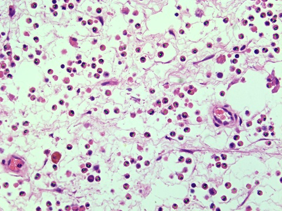
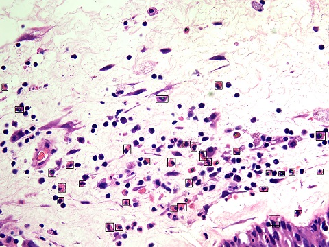
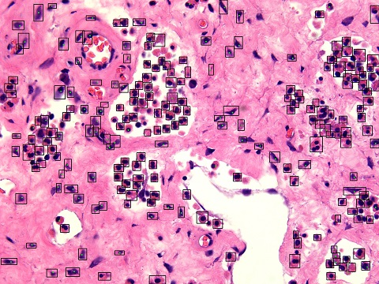
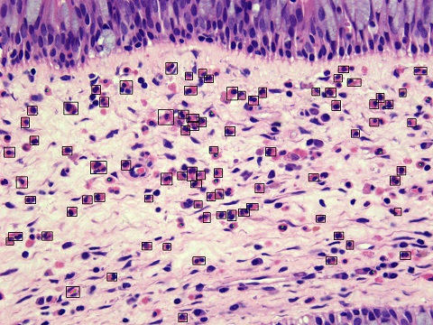
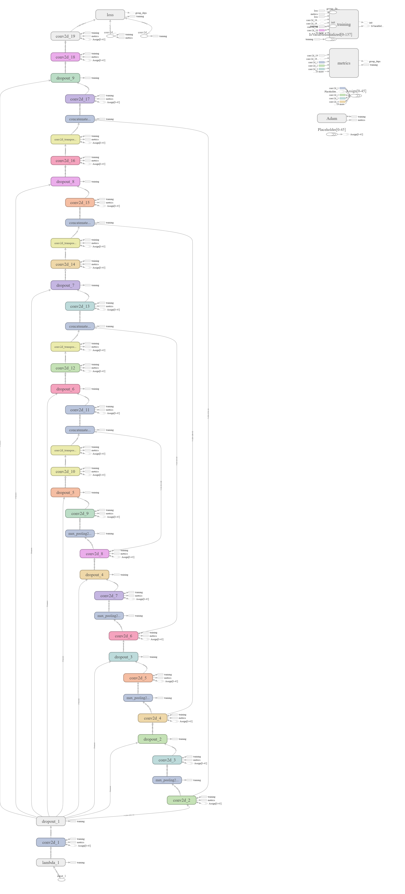
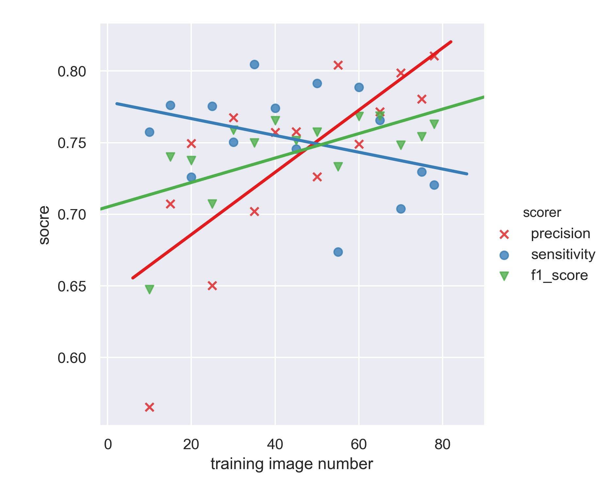

Project for EOS detection
===

## 1. Construction

### 1.1. Kindle

For preparation, we labelled 7 H&E slices. We marked the cells in these images by green points, which are easy to be implemented and detected by both computers and human beings. 

**Cell_segment.py** harnessed openCV's *cv2.THRESH_BINARY_INV | cv2.THRESH_OTSU* and *watershed* to detect cells and then based on the point labels to segment them into 96 * 96 small individual cells.

**Cell_traning.py** constructed a simple CNN model on Keras powered by Tensorflow. The CNN learned the individual cell images we created in the previous step. Then, it could roughly classify the cell type (whether it's a EOS) on a cell image.

We wanted to accelerate the advance of this project. Part of the bottleneck is limited labour we had for labelling. More importantly, labelling is quite boring. To open the bottleneck and avoid boredom, we used the simple CNN model to help us. That is the content of **Cell_recognition.py**. After the openCV segmented possible cell areas, the CNN would label the areas by its judgment. It marked EOS it classified by black box. We corrected its work, then. If a label was right, we left it there. Otherwise, we marked a green point inside the black box. Besides, we also mark some cells it didn't notice, by green point. As a result, the label areas are which only in black boxes or only have green points. The suffix of labelled images is **_label**.

At that moment, we had a huge mistake in design, that is we let the black boxes as markers, which can easily overlap with the near and make the labelled images hard to be used by other models or reused. It's because this kind of markers doesn't clearly and simply tell what is the interest. Therefore, we added another type of labelled images for human-label and machine-label integration. This type uses point markers with 5 pixels as radius and green as color. The suffix of this type is **_help**.

**Cell_refine.py** read the special labels the CNN and we created before. Then, the CNN learned these new data. As a result, it could work better in helping us label. We could generate more data in a certain period, in this way, and it can learn more. As a result, it learned more, and we can generate more data. A virtuous circle emerged.

However, this method would come to its limitation somehow. Cutting-edge technology is needed.

*Kindel Phase | Phase Zero*

*Phase Zero Outcome -> Phase One Input*

*Phase One Outcome -> Phase Two Input*

*Phase Two Outcome -> Phase Three Input*

It's hard to improve the performance further.

### 1.2. Unet

The [__**paper**__](https://arxiv.org/abs/1505.04597) was Submitted on 18 May 2015 by authors -- Olaf Ronneberger, Philipp Fischer, Thomas Brox. Following is the abstract.

--*There is large consent that successful training of deep networks requires many thousand annotated training samples. In this paper, we present a network and training strategy that relies on the strong use of data augmentation to use the available annotated samples more efficiently. The architecture consists of a contracting path to capture context and a symmetric expanding path that enables precise localization. We show that such a network can be trained end-to-end from very few images and outperforms the prior best method (a sliding-window convolutional network) on the ISBI challenge for segmentation of neuronal structures in electron microscopic stacks. Using the same network trained on transmitted light microscopy images (phase contrast and DIC) we won the ISBI cell tracking challenge 2015 in these categories by a large margin. Moreover, the network is fast. Segmentation of a 512x512 image takes less than a second on a recent GPU.*

The origin version of Unet powered by Keras may be [this](https://github.com/zhixuhao/unet), which was inspired by [U-Net: Convolutional Networks for Biomedical Image Segmentation](http://lmb.informatik.uni-freiburg.de/people/ronneber/u-net/). 

Our version looks like below.

Also, I have pre-trained the model used the data from [Kaggle](https://www.kaggle.com/c/data-science-bowl-2018): _2018 Data Science Bowl -- Find the nuclei in divergent images to advance medical discovery._ However, The result has showed this dataset cannot help to improve our model's performance. The lowest *val_loss* of __from stracth__ model is 0.02164, while that of __on kaggle dataset__ model is 0.02295. The difference is not evident. Still, Many functions are adaptations from its notebooks, including [nuclei-overview-to-submission](https://www.kaggle.com/kmader/nuclei-overview-to-submission/notebook), [keras-u-net-starter](https://www.kaggle.com/keegil/keras-u-net-starter-lb-0-277/notebook), [identification-and-segmentation-of-nuclei-in-cells](https://www.kaggle.com/paultimothymooney/identification-and-segmentation-of-nuclei-in-cells) and [basic-pure-computer-vision-segmentation](https://www.kaggle.com/gaborvecsei/basic-pure-computer-vision-segmentation-lb-0-229). Their insights did a great help. **Thank!**

### 1.3. Training

__Now, the following part 1, 2, 3 is combined into a pipeline *preparation.py*.__

#### 1.3.1. point_label_creator

*Input: a raw images directory path; a labelled images directory path; a directory path for saving*

*Return: point label **.png** files in saving directory*

The aim of this part is to compromise with the deficits of a previous bad design that we use the boxed marked images to assist the label progress. However, when it comes to reusing these labelled images, boxes and masks don't cooperate well. It's too large to identify a single area. In contrary, points can do a good job in this work. As a result, we decide to convert the black boxes to green points, in order to make masks by labelled images.

Now, we will generate two versions of assistant prediction, a circle labelled version and a point labelled version. The circle labelled version can help the researchers detect and correct the mistakes the model made. It's just because a circle is easy to be seen by naked eyes. The point labelled version can record the prediction the model made and it will not confuse the openCV, when the openCV creates masks by labelled images. *As a result, this part may be no longer useful.*

#### 1.3.2. point_to_maskor

*Input: a raw images directory path; a point labelled images directory path; a directory path for saving*

*Return: mask **.png** files in saving directory*

The aim of this part is to convert green points to masks. Unet uses masks as its outcomes. To train a Unet model, enough masks are necessary.

The downside of this part is that we use watershed algorithm to segment areas in the first place. Then, the quality of the masks is unstable. However, a large number of training images can circumvent this weakness. Moreover, we want to make the Unet model can learn as many scenes as possible.

#### 1.3.3. tile_creator

*Input: a raw images directory path; a mask images directory path; a directory path for saving*

*Return: tile **.png** files in saving directory*

The information in H&E slides is important, so we decide not to limit it at the beginning, that is not to resize the images. The aim of this part is to separate large images into small images. The original images are usually 1920 * 1440. We create 256 * 256 small images from them. We make the images contain overlaps to contain virgin information from the original images. The number of small images is to make the overall overlap areas as small as possible.

#### 1.3.4. Unet_trainor

*Input: tiles for training directory path; tiles for test directory path; model name; retrained model path*

*Return: tile **.png** files in saving directory*
__(The model with *.h5* suffix is saved in the director *unet_tools* for *use_model.py*'s future use.)__
_(If the "tiles for test directory path" is "No", this script will create train dataset and test dataset from the tiles in the "tiles for training directory".)_
_(If "the retrained model path" is not provided, the script will generate a model from scratch.)_

This part can train our model from scratch or retrain the previous existing model. The function is quite simple. See more information in **2.Unet part**.

### 1.4 Current Performance

We randomly sampled 20 well point-labelled images into a test set. By using a different number of training images, we computer how precision, sensitivity and f1_score change as the training image number changes. Also, taking this in mind that the new data's quality will influence the result of test evaluation. The quality not only refers to the accuracy of labels, also to the extent of similarity between the test and these data. 

|    |   true_positive |   false_positive |   false_negative |   precision |   sensitivity |   f1_score |   training image number |
|---:|----------------:|-----------------:|-----------------:|------------:|--------------:|-----------:|------------------------:|
|  0 |            1089 |              837 |              349 |    0.565421 |      0.757302 |   0.647444 |                      10 |
|  1 |            1116 |              462 |              322 |    0.707224 |      0.776078 |   0.740053 |                      15 |
|  2 |            1044 |              349 |              394 |    0.749462 |      0.726008 |   0.737549 |                      20 |
|  3 |            1115 |              600 |              323 |    0.650146 |      0.775382 |   0.707263 |                      25 |
|  4 |            1079 |              327 |              359 |    0.767425 |      0.750348 |   0.75879  |                      30 |
|  5 |            1157 |              491 |              281 |    0.702063 |      0.80459  |   0.749838 |                      35 |
|  6 |            1113 |              357 |              325 |    0.757143 |      0.773992 |   0.765475 |                      40 |
|  7 |            1072 |              343 |              366 |    0.757597 |      0.74548  |   0.75149  |                      45 |
|  8 |            1138 |              429 |              300 |    0.726228 |      0.791377 |   0.757404 |                      50 |
|  9 |             969 |              236 |              469 |    0.804149 |      0.673853 |   0.733258 |                      55 |
| 10 |            1134 |              380 |              304 |    0.749009 |      0.788595 |   0.768293 |                      60 |
| 11 |            1101 |              326 |              337 |    0.771549 |      0.765647 |   0.768586 |                      65 |
| 12 |            1012 |              255 |              426 |    0.798737 |      0.703755 |   0.748244 |                      70 |
| 13 |            1049 |              295 |              389 |    0.780506 |      0.729485 |   0.754134 |                      75 |
| 14 |            1036 |              242 |              402 |    0.810642 |      0.720445 |   0.762887 |                      78 |

The correlation between image numbers and the performance could be described as below.

|             |        slope |   intercept |   correlation coefficient |   two-sided p-value |   Standard error |
|:------------|-------------:|------------:|--------------------------:|--------------------:|-----------------:|
| precision   |  0.00216931  |    0.642491 |                  0.746433 |          0.00139126 |      0.00053639  |
| sensitivity | -0.000585995 |    0.778447 |                 -0.360483 |          0.186858   |      0.000420542 |
| f1_score    |  0.00085291  |    0.705113 |                  0.60903  |          0.015961   |      0.000308068 |

## 2. Usage

### 2.1. Installation (MAKESHIFT version)

#### 2.1.1. Miniconda ~~Anaconda~~ -- Python data science platform 

To shorten the download time. We first recommend download Miniconda, which provides the basic *conda* platform for our application. See [Miniconda](https://conda.io/miniconda.html) download page. Currently, you need to download Python 3.7 version. 

Or, see [Anaconda](https://www.anaconda.com/download/) download page. Currently, you need to download Python 3.7 version as well. For more details, please check its [official documentation](https://docs.anaconda.com/anaconda/).

There is no difference between these two versions if you only consider testing our software. If you are interested in Python and want to learn more about it, Anaconda is a better choice. Anaconda supply many pre-installed packages that can save lots of time in the long run.

#### 2.1.2. Required packages

**For Chinese Users, we recommend you input following commands in your Anaconda Prompt to use the [mirror](https://mirror.tuna.tsinghua.edu.cn/help/anaconda/) from Tsinghua University.**

        conda config --add channels https://mirrors.tuna.tsinghua.edu.cn/anaconda/pkgs/free/

        conda config --add channels https://mirrors.tuna.tsinghua.edu.cn/anaconda/pkgs/main/

        conda config --set show_channel_urls yes

**Continue, input following commands in your Anaconda Prompt**

        conda create --name eos python=3.6 tensorflow-gpu opencv pandas keras scikit-learn pillow matplotlib scikit-image openpyxl

If you have GPU in your computer, add the following line to improve the speed of procession.

        conda install tensorflow-gpu

__TODO (Tesing)__

#### 2.1.3. Clone or Download

We recommend you use git to _clone_ the [repository]https://github.com/Moo-YewTsing/EOS-Detection.git. by

        git clone https://github.com/Moo-YewTsing/EOS-Detection.git

Or you can simply _download_ all by this [link](https://codeload.github.com/Moo-YewTsing/EOS-Detection/zip/master).

Open your terminal, _cd_ to the directory where the repository's files are.

### 2.2. GUI

        python demoGUI.py

Then, a user interface will emerge. Check Help in the menubar.

### 2.3. Pipeline

Now, we provide two pipeline for data preparation and model evaluation.

#### 2.3.1. __Data Preparation__

Input your imgs_dir, labels_dir and dst to the following command.

(imgs_dir is the path of the directory where original images are.
labels_dir is the path of the directory where labelled images are. The labelled images can be green-point-marked only, green-point&black-box-marked mixed or black-box-marked only. For better performance, we suggest following our label rules and correspondent refining rules, that will be green-point-marked only.
dst is the path where directories will be made and data will be saved.)

        python pipe_preparation.py imgs_dir labels_dir dst

#### 2.3.2. __Model Evaluation__

Input your imgs_dir , masks_dir, tiles_dir and dst to the following command.

(imgs_dir is the path of the directory where original images are.
masks_dir is the path of the directory where masked images are.
tiles_dir is the path of the directory where tile images are.
dst is the path where directories will be made and data will be saved.)

        python pipe_metric.py imgs_dir masks_dir tiles_dir dst

__TODO__